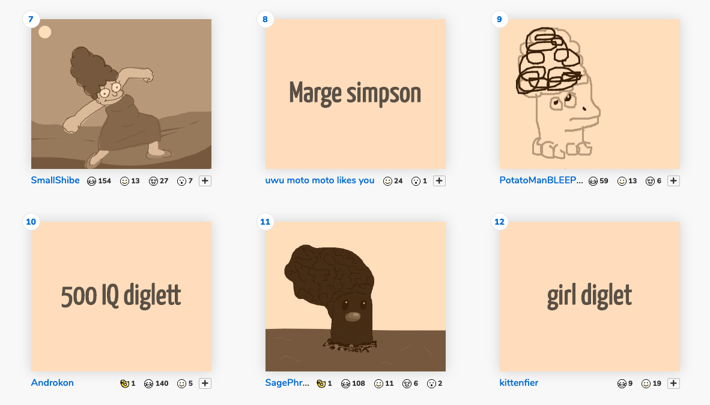

# Lost in Translation
NYU ITP 2019 Thesis 
An interactive experience to see how machine interpret one thing differently from human.

	

[Presentation Video](https://vimeo.com/336826469) in ITP Thesis Week 2019

## Introduction
The project has a recursive process for human and machine to interpret each other’s results. Human needs to come up with a sentence to describe an image generated by machine and the machine will do multiple machine learning translations from the description from human to a sketch and then to an image in each round of process.

## Inspiration
### Telephone Game
An example of multiple translations 
[Drawception - Picture Telephone Drawing Game](https://drawception.com/)

	

### Closed Loop
A project uses machine learning to do feedback loop on images and texts. 
[Jake Elwes - Closed Loop](https://www.jakeelwes.com/project-closedLoop.html)

## Implementation

	

* Python Server with *Flask*
* Javascript Client 
* Generate a sentence from an image by *im2txt*
* Find word tags and get nouns by *SpaCy*
* Word Vector similarity by *SpaCy*
* Draw doodles by *SketchRNN*
* Generate new images by *AttnGan* 

### app.py
Server code 
Coordinate and process most of the data. 
Use http connection to communicate with Runway and Client.

### static/client.js
Client Code 
Present the result and collect user input.

### categories.json
A Json file that store all sketch categories

### draw_strokes.py
functions to draw sketch

### drawSketch.py
a test function to draw sketch

### im2txt
A machine learning model that can generate a sentence based on an image. 
The model is originated from [models/research/im2txt](https://github.com/tensorflow/models/tree/master/research/im2txt).
A pre-trained model is provided in [Runway](https://runwayml.com/). 

### SketchRNN
A machine learning model that can generate doodle in specific categories. 
The doodle data is from [Quick, Draw! The Data](https://quickdraw.withgoogle.com/data) and the model detail is from [Magenta - SketchRNN](https://github.com/tensorflow/magenta/tree/master/magenta/models/sketch_rnn). 
It is downloaded from [Google Cloud Platform](https://console.cloud.google.com/storage/browser/quickdraw_dataset/sketchrnn?pli=1).

### AttnGan
The model is from [GitHub - taoxugit/AttnGAN](https://github.com/taoxugit/AttnGAN). 
A machine learning model that can generate image from a sentence. 
A pre-trained model is provided in [Runway](https://runwayml.com/).  

	

